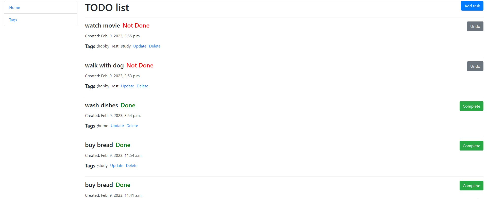

#  ToDoList-project
TogDoList project is an application specially built to keep track of errands or tasks that need to be done. This application will be like a task keeper where the user would be able to enter the tasks that they need to do. Once they are done with their tasks they can also remove them from the list


#### Features

* Functionality for Task, Tag
* Managing tasks/tags  from website interface
* Powerful admin panel for advanced managing

#### Test user

* User: `admin`

* Password: `2105Inna75`
* 
#### Demo



#### Installation
##### Python3 must be already installed.

```
git clone https://github.com/InnaKuhsnir/to-do-list

cd to-do-list

python3 -m venv venv

source venv/bin/activate

pip3 install -r requirements.txt

python3 manage.py migrate

python3 manage.py runserver 
```
